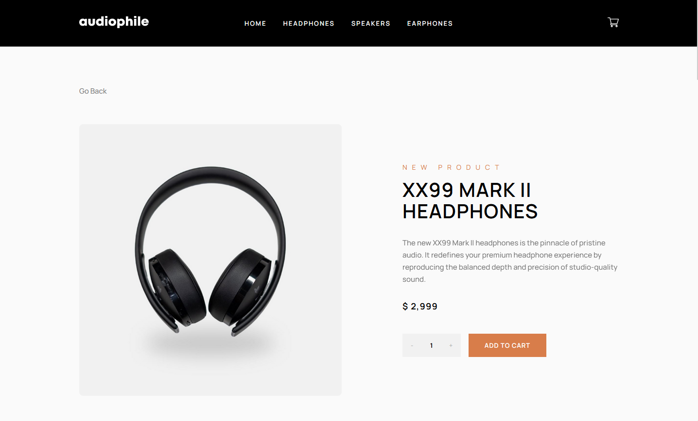
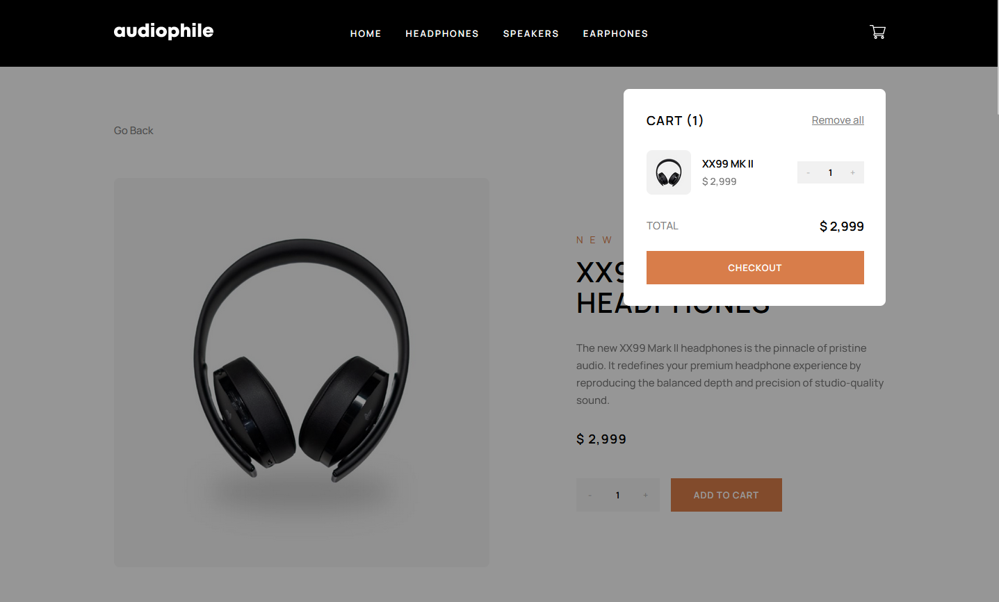
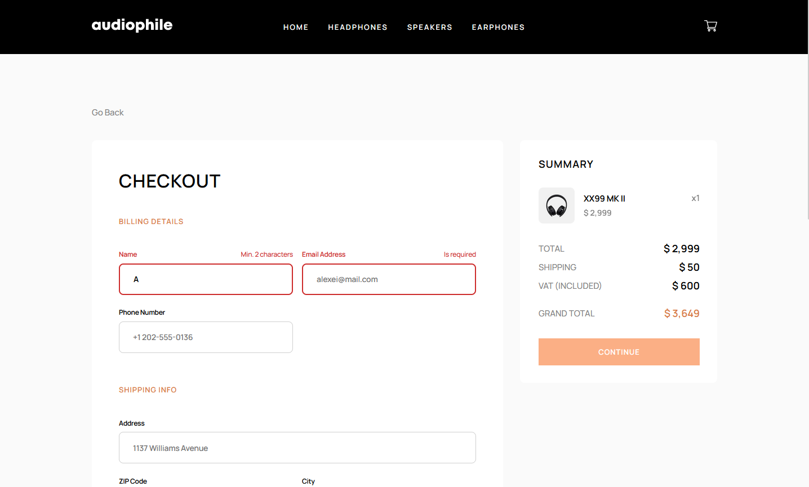
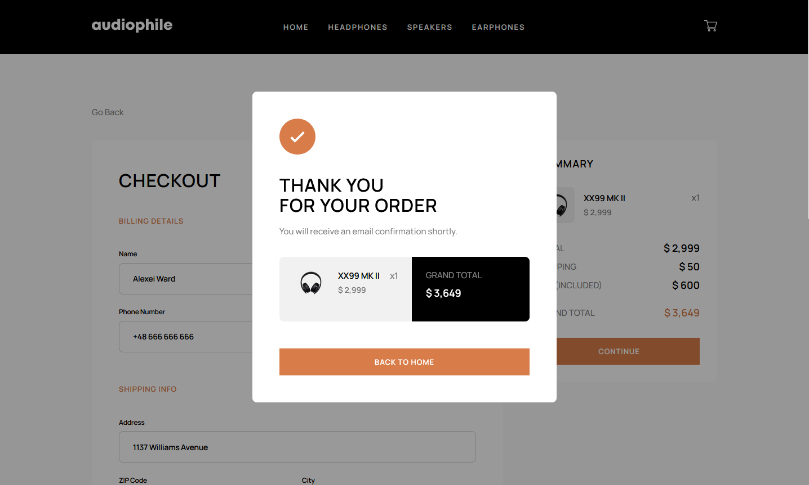
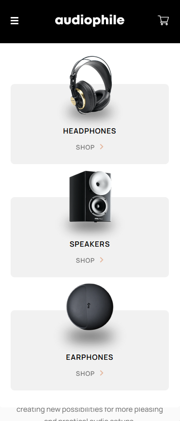
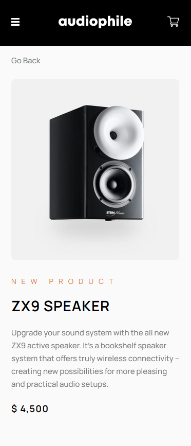
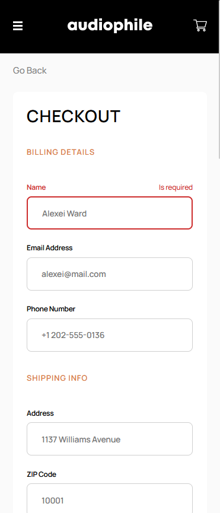

# Frontend Mentor - Audiophile ecommerce website

 
 
 
 

## Developed with

- React, CSS-modules
- The design of the project was based on BrowserRouter and useContext

## The challenge

Users should be able to:

- View the optimal layout for the app depending on their device's screen size
- See hover states for all interactive elements on the page
- Add/Remove products from the cart
- Edit product quantities in the cart
- Fill in all fields in the checkout
- Receive form validations if fields are missed or incorrect during checkout
- See correct checkout totals depending on the products in the cart
  - Shipping always adds $50 to the order
  - VAT is calculated as 20% of the product total, excluding shipping
- See an order confirmation modal after checking out with an order summary
- **Bonus**: Keep track of what's in the cart, even after refreshing the browser
  (`localStorage` could be used for this if you're not building out a full-stack
  app)
